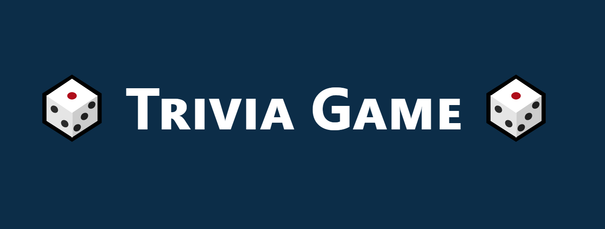

<div id="top"></div>

[![Contributors][contributors-shield]][contributors-url]
[![Forks][forks-shield]][forks-url]
[![Stargazers][stars-shield]][stars-url]
[![Issues][issues-shield]][issues-url]
[![MIT License][license-shield]][license-url]
[![LinkedIn][linkedin-shield]][linkedin-url]

<!-- PROJECT LOGO -->
<br />
<div align="center">
  <a href="https://github.com/DMCFA/trivia-game">
    
  </a>

  <h3 align="center">Trivia Game</h3>

  <p align="center">
    A Trivia Game for all tastes
    <br />
    <a href="https://github.com/DMCFA/trivia-game"><strong>Explore the docs »</strong></a>
    <br />
    <br />
    <a href="https://clever-bell-3a3b47.netlify.app/">View Demo</a>
    ·
    <a href="https://github.com/DMCFA/trivia-game/issues">Report Bug</a>
    ·
    <a href="https://github.com/DMCFA/trivia-game/issues">Request Feature</a>
  </p>
</div>

<!-- TABLE OF CONTENTS -->
<details>
  <summary>Table of Contents</summary>
  <ol>
    <li>
      <a href="#about-the-project">About The Project</a>
      <ul>
        <li><a href="#built-with">Built With</a></li>
      </ul>
    </li>
    <li>
      <a href="#getting-started">Getting Started</a>
      <ul>
        <li><a href="#prerequisites">Prerequisites</a></li>
        <li><a href="#installation">Installation</a></li>
      </ul>
    </li>
    <li><a href="#usage">Usage</a></li>
    <li><a href="#roadmap">Roadmap</a></li>
    <li><a href="#contributing">Contributing</a></li>
    <li><a href="#license">License</a></li>
    <li><a href="#contact">Contact</a></li>
    <li><a href="#acknowledgments">Acknowledgments</a></li>
  </ol>
</details>

<!-- ABOUT THE PROJECT -->

## About The Project

This a fun little personal project of mine, where I decided to create a trivia game app with different categories and difficulty to entertain when you are in need of killing some time.

<p align="right">(<a href="#top">back to top</a>)</p>

### Built With

- [JavaScript](https://javascript.com/)
- [React.js](https://reactjs.org/)
- [Redux](https://redux-toolkit.js.org/)
- [Bootstrap](https://getbootstrap.com)

<p align="right">(<a href="#top">back to top</a>)</p>

<!-- GETTING STARTED -->

## Getting Started

To get a local copy up and running follow these simple example steps below:

### Prerequisites

- npm
  ```sh
  npm install npm@latest -g
  ```

### Installation

1. Get all the API Data from [Open Trivia Database](https://opentdb.com/)
2. Clone the repo
   ```sh
   git clone https://github.com/DMCFA/trivia-game.git
   ```
3. Install NPM packages
   ```sh
   npm install
   ```

<p align="right">(<a href="#top">back to top</a>)</p>

<!-- USAGE EXAMPLES -->

## Usage

Just make your selections on the opening page and you will be prompt to the game page where you can answer all questions and test your knowledge!

<p align="right">(<a href="#top">back to top</a>)</p>

<!-- ROADMAP -->

## Roadmap

- [x] Start project
- [x] Finish desktop and add demo page
- [ ] Mobile-friendly
- [ ] Finish full project and testing (85% done)
- [ ] Add Additional Templates w/ Examples
- [ ] Multi-language Support
  - [ ] Chinese
  - [ ] Spanish

See the [open issues](https://github.com/DMCFA/trivia-game/issues) for a full list of proposed features (and known issues).

<p align="right">(<a href="#top">back to top</a>)</p>

<!-- CONTRIBUTING -->

## Contributing

Contributions are what make the open source community such an amazing place to learn, inspire, and create. Any contributions you make are **greatly appreciated**.

If you have a suggestion that would make this better, please fork the repo and create a pull request. You can also simply open an issue with the tag "enhancement".

1. Fork the Project
2. Create your Feature Branch (`git checkout -b feature/AmazingFeature`)
3. Commit your Changes (`git commit -m 'Add some AmazingFeature'`)
4. Push to the Branch (`git push origin feature/AmazingFeature`)
5. Open a Pull Request

<p align="right">(<a href="#top">back to top</a>)</p>

<!-- LICENSE -->

## License

Distributed under the MIT License. See `LICENSE.txt` for more information.

<p align="right">(<a href="#top">back to top</a>)</p>

<!-- CONTACT -->

## Contact

Duarte Almeida - [DMCFA](https://linkedin.com/in/duarte-almeida-dmcfa/)

Project Link: [https://github.com/DMCFA/trivia-game](https://github.com/DMCFA/trivia-game)

<p align="right">(<a href="#top">back to top</a>)</p>

<!-- ACKNOWLEDGMENTS -->

## Acknowledgments

Use this space to list resources you find helpful and would like to give credit to. I've included a few of my favorites to kick things off!

- [Open Trivia Database](https://opentdb.com/)
- [Axios](https://axios-http.com/)
- [Jest](https://jestjs.io)
- [React-router](https://github.com/remix-run/react-router)
- [React scroll](https://github.com/fisshy/react-scroll)
- [React Toastify](https://fkhadra.github.io/react-toastify/introduction)
- [ReadMe Template](https://github.com/othneildrew/Best-README-Template/issues)
- [Font Awesome](https://fontawesome.com)
- [Google Fonts](https://fonts.google.com/)

<p align="right">(<a href="#top">back to top</a>)</p>

<!-- MARKDOWN LINKS & IMAGES -->
<!-- https://www.markdownguide.org/basic-syntax/#reference-style-links -->

[contributors-shield]: https://img.shields.io/github/contributors/DMCFA/trivia-game.svg?style=for-the-badge
[contributors-url]: https://github.com/DMCFA/trivia-game/graphs/contributors
[forks-shield]: https://img.shields.io/github/forks/DMCFA/trivia-game.svg?style=for-the-badge
[forks-url]: https://github.com/DMCFA/trivia-game/network/members
[stars-shield]: https://img.shields.io/github/stars/DMCFA/trivia-game.svg?style=for-the-badge
[stars-url]: https://github.com/DMCFA/trivia-game/stargazers
[issues-shield]: https://img.shields.io/github/issues/DMCFA/trivia-game.svg?style=for-the-badge
[issues-url]: https://github.com/DMCFA/trivia-game/issues
[license-shield]: https://img.shields.io/github/license/DMCFA/trivia-game.svg?style=for-the-badge
[license-url]: https://github.com/DMCFA/trivia-game/blob/main/LICENSE
[linkedin-shield]: https://img.shields.io/badge/-LinkedIn-black.svg?style=for-the-badge&logo=linkedin&colorB=555
[linkedin-url]: https://linkedin.com/in/duarte-almeida-dmcfa/
